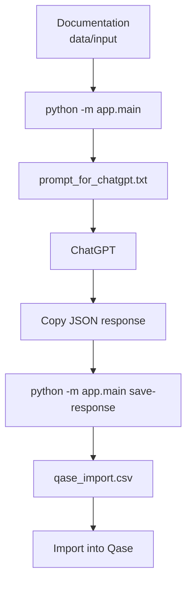

# Qase AI Test Case Generator (Hybrid Mode)

A QA tool that:

- reads project documentation from files
- generates a ChatGPT prompt for test case creation
- helps generate QA-focused test cases through ChatGPT
- automatically converts the ChatGPT response into CSV for import into Qase

⚠️ No API key is required.  
The tool works in hybrid mode: the project generates a prompt, you use ChatGPT manually, then the tool converts the response into CSV.

---

## How it works



---

## Requirements

- macOS / Linux / Windows
- Python 3.10+
- PyCharm or any IDE

---

## Installation

```bash
git clone <repo>
cd qase_ai_generator

python3 -m venv .venv
source .venv/bin/activate

pip install -r requirements.txt
```

---

## Project structure

```text
data/
├── input/        ← documentation files
├── output/       ← generated results
└── templates/
    └── qase_template.csv
```

---

## Qase template

The project already contains a default Qase CSV template:

```text
data/templates/qase_template.csv
```

This file is used automatically when generating the final CSV.

Default minimal template:

```csv
Title,Priority
Sample test case,High
```

---

## How to customize the Qase template

You only need to change the template if your Qase project has:

- custom fields
- required fields
- different column names
- a specific import format configured by your team

To customize it:

1. Open Qase
2. Create or open any existing test case
3. Export it as CSV
4. Replace the existing file:

```text
data/templates/qase_template.csv
```

5. Run the generator again

Important:

- Do not rename the file
- Keep it as `qase_template.csv`
- Do not manually invent column names unless you know Qase accepts them
- The tool fills only supported fields from the generated JSON, usually `Title` and `Priority`
- Other columns from your template will remain empty unless exporter logic is extended

---

## Prompt profiles

The tool supports different prompt profiles depending on the feature type.

Available profiles:

```text
general
web
backend
payment
game
```

### Profile descriptions

| Profile | Use when |
|---|---|
| `general` | Generic feature, mixed documentation, unknown type |
| `web` | Web UI, forms, screens, browser behavior |
| `backend` | API, server logic, validation, states |
| `payment` | Payments, purchases, transactions, money-related flows |
| `game` | Game mechanics, live events, rewards, progression |

---

## Set default prompt profile

You can set the default profile in `.env`:

```env
OPENAI_MODE=manual
PROMPT_PROFILE=general
```

Example:

```env
PROMPT_PROFILE=game
```

---

## Run with a specific profile from terminal

You can override the default profile when generating the prompt:

```bash
python -m app.main --profile game
```

Examples:

```bash
python -m app.main --profile web
python -m app.main --profile backend
python -m app.main --profile payment
python -m app.main --profile game
```

---

## Run with GUI

If the GUI is enabled, run:

```bash
python -m app.gui
```

In the GUI you can:

1. Add documentation files
2. Select prompt profile
3. Generate prompt
4. Copy ChatGPT response
5. Generate Qase CSV
6. Open output folder
7. Clean output

---

## Step-by-step workflow

### 1. Add documentation

Put your documentation files into:

```text
data/input/
```

Supported formats:

```text
.txt
.md
.pdf
.docx
.xlsx
```

---

### 2. Generate prompt

Using default profile:

```bash
python -m app.main
```

Using a specific profile:

```bash
python -m app.main --profile game
```

Output:

```text
data/output/
├── prompt_for_chatgpt.txt
├── source_preview.txt
```

---

### 3. Use ChatGPT

1. Open:

```text
data/output/prompt_for_chatgpt.txt
```

2. Copy the full prompt
3. Paste it into ChatGPT
4. Get JSON response

---

### 4. Copy ChatGPT response

Do not create `manual_response.json` manually.

Just:

1. Select the full JSON response from ChatGPT
2. Copy it with `Cmd + C` on macOS or `Ctrl + C` on Windows/Linux

---

### 5. Generate CSV automatically

```bash
python -m app.main save-response
```

The tool will:

1. Read the copied response from clipboard
2. Save it as:

```text
data/output/manual_response.json
```

3. Generate:

```text
data/output/generated_cases.json
data/output/qase_import.csv
```

---

### 6. Import into Qase

1. Open Qase
2. Go to Import
3. Select Qase.io CSV
4. Upload:

```text
data/output/qase_import.csv
```

---

### Clean generated files

To remove generated files from `data/output/`:

```bash
python -m app.main clean
```

This removes:

```text
prompt_for_chatgpt.txt
source_preview.txt
manual_response.json
generated_cases.json
qase_import.csv
```

---

## Expected ChatGPT response format

ChatGPT must return valid JSON:

```json
{
  "test_cases": [
    {
      "title": "User can log in with valid email and password",
      "priority": "High"
    }
  ]
}
```

Allowed priority values:

```text
High
Medium
Low
Not Set
```

---

## Important JSON rules

ChatGPT response must contain only JSON.

Do not include:

```text
```json
```

Do not include:

- markdown formatting
- text before JSON
- text after JSON
- single quotes
- comments
- extra fields

Correct:

```json
{
  "test_cases": [
    {
      "title": "User receives reward after completing the event",
      "priority": "High"
    }
  ]
}
```

Incorrect:

````text
```json
{
  "test_cases": []
}
```
or

Here are your test cases:
{
  "test_cases": []
}
````
## Common issues

If you encounter errors during usage, most problems are related to input files, JSON format, or Qase template configuration.

1. The error `No supported files found in data/input` means that the tool did not detect any valid files. Make sure that at least one file exists inside `data/input/` and that it has a supported format such as `.txt`, `.md`, `.pdf`, `.docx`, or `.xlsx`.

2. If you see a JSON parsing error like `Expecting property name enclosed in double quotes`, it means that the ChatGPT response is not valid JSON. This usually happens when the response includes markdown (like ```json), extra text before or after the JSON, or uses single quotes instead of double quotes. Ensure that you copy only clean JSON without any additional formatting.

3. If the CSV import fails in Qase, verify that the file `data/templates/qase_template.csv` exists and is valid. If your Qase project uses custom fields or a specific import format, export a real test case from Qase and replace the template file. Do not rename the file, as the tool expects it to have a fixed name.

4. If the generated test cases look incorrect or too generic, check which prompt profile is being used. The default profile is defined in `.env` via `PROMPT_PROFILE`. You can also override it manually using a command like `python -m app.main --profile game`. Using the correct profile (web, backend, payment, game) significantly improves the quality of generated test cases.

5. In general, if something goes wrong, first check the input files, then verify the ChatGPT response format, and finally ensure that the Qase template matches your project configuration.

## Recommendations 
1. Generate test cases per feature, not for the entire project at once 
2. Use the game profile for game events, rewards, progression, mechanics 
3. Use the payment profile for purchases and money-related flows 
4. Use the web profile for UI-heavy web features 
5. Use the backend profile for APIs and server-side logic 
6. Review generated_cases.json before importing into Qase 
7. Import into a temporary or test suite first 
8. Review generated test cases manually before using them in production test documentation